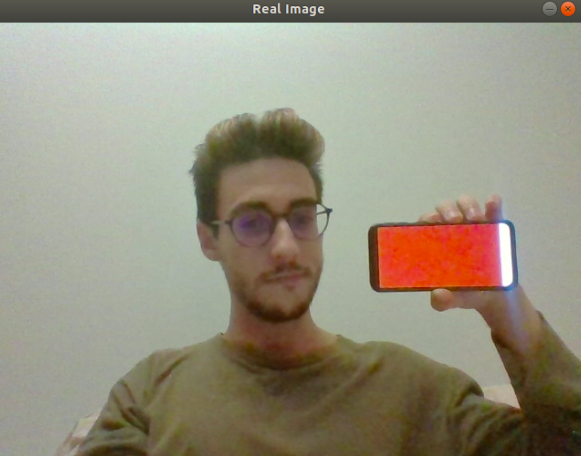
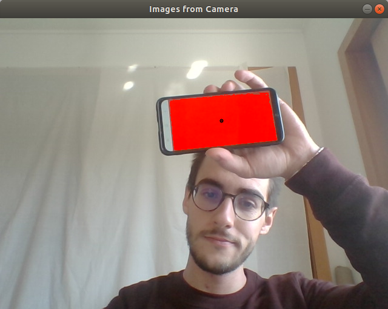

# PARI Augmented Reality Paint
Welcome to the Augmented Reality Paint.
Here you can give wings to your artist side by drawing your magnificent dream paint with your own hands.

In order to properly use the Augmented Reality Paint, there are two steps required:

- [Select the pencil object](#select-the-pencil-object)
- [Paint the canvas](#paint-the-canvas)

# Select the pencil object
First of all, you will need a real object to be your brush. This object should have a distinct color between all your background colors.
After you have your object, you should run, in your terminal, the following command:
    
    color_segmenter.py
    
This will open two windows: the Real Image and the Color Segmenter.
In the Real Image, you can see yourself and your surrounding environment; in the Color Segmenter you get to chose a threshold to mask only the objects that you want.

The gold of the Color Segmenter is to choose the boundaries of each RGB value so that the Reality Paint could always detect where is the object with that specified color range. 

For example, if the real image is:

The Color Segmenter window will have the next presentation:

Now, its time to adjust the RGB values to only mask the red object:

To save these values, you just need to press 'w' (stands for write). This key will create a JSON file and write the min and max values of color parameter.
To quit, press the key "q" (stands for quit)

The JSON file created (called limits.json) has the following structure:
    
    {"R": {"max": 255, "min": 183}, "B": {"max": 168, "min": 0}, "G": {"max": 150, "min": 0}}

# Paint the canvas

After you select the RGB boundaries in order to the Augmented Reality Paint recognize your pencil object, it is now time to put the hands into work!
By running the following command line, in terminal:

    ar_paint.py
     
You should see your canvas, with a white background, and, by moving your object in front of the camera, you will start drawing dark lines.
Besides this white board, it is also possible to see yourself in a video frame window, to help you understand where is your pencil. In this video window, the centroid os the recognized object is marked by a black dot.

The canvas window is similar to the following window:

And the Images from Camera window should have the black dot in the middle of the object:

As a good painting program, the Augmented Reality Paint let yuo paint in other colors, lines with more or less thickness , and erase some lines. All these commands are controlled with the keyboard as follows:

Key | Function 
--- | --- 
'r' | paint in red 
'g' | paint in green 
'b' | paint in blue
'n' | paint in black (default color)
'+' | increase the thickness of the pencil 
'-' | decrease the thickness of the pencil 
'e' | erase lines (the thickness size also works for the eraser) 
'c' | clear all the drawings, letting the board clean, as it starts
'w' | write for the program folder an image with your painting 
'q' | quit the Augmented Reality Paint

Besides all of the already presented, the Augmented Reality Paint could be launched with two parameters: the Use Shake Detection and the Use Canvas Mode.

**User Shake Detection** 

The User Shake Detection prevents the situations when you hide your object (pencil) or when the program does not detect it. By default, the Augmented Reality Paint will draw a straight line connecting the last point where the object was with the recent recognized point, even if these two points are far away from each other.
AS you might imagine, this will create a not so beautiful painting image. If you run the Augmented Reality Paint with the -usp command, this will not happen. You can hide your object and then show it in a different place, as like if you are lifting the pencil of the paper!

**Use Canvas Mode**

The Use Canvas Mode change the background of the drawing board, from white (default) for your own video frame. This means that if you launch the Augmented Reality Paint with the -ucm parameter, you will draw on top of the video frame.

Running the program with these two parameters:

    ar_paint.py -usp -ucm
    
You will be able to draw like this:

As said before, it is possible to, at any time, save an image of the drawing, by pressing the 'w' key. These command will save in the same directory a png file with the current date:

    drawing_Tue_Sep_15_10:36:39_2020.png
    
And now, you are ready to start using the Augmented Reality Paint and show off your skills. Enjoy! 

  